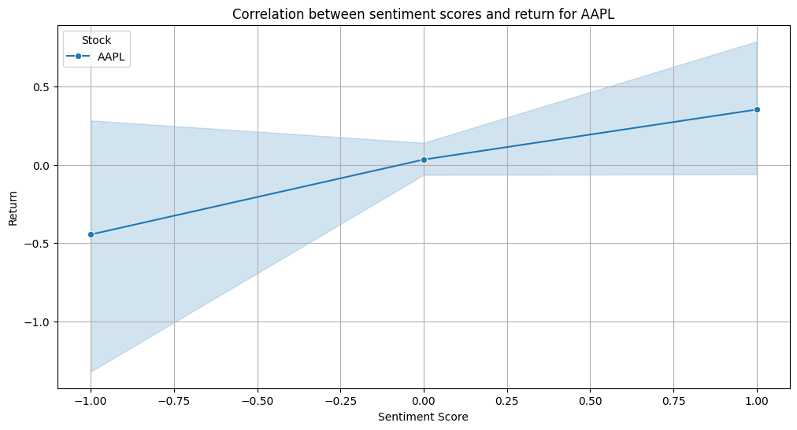
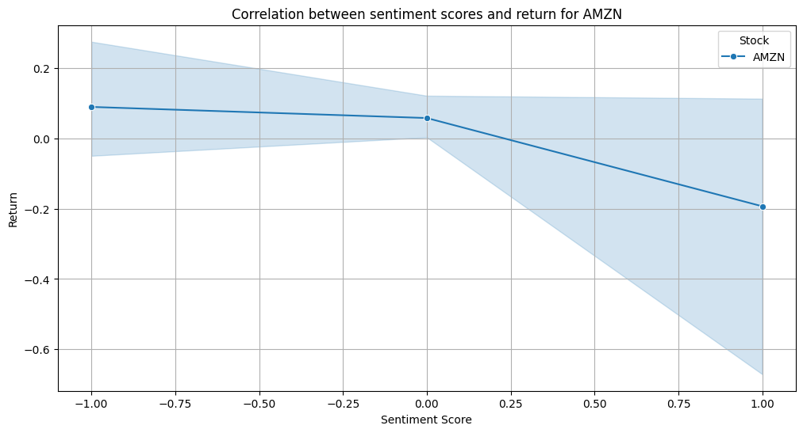
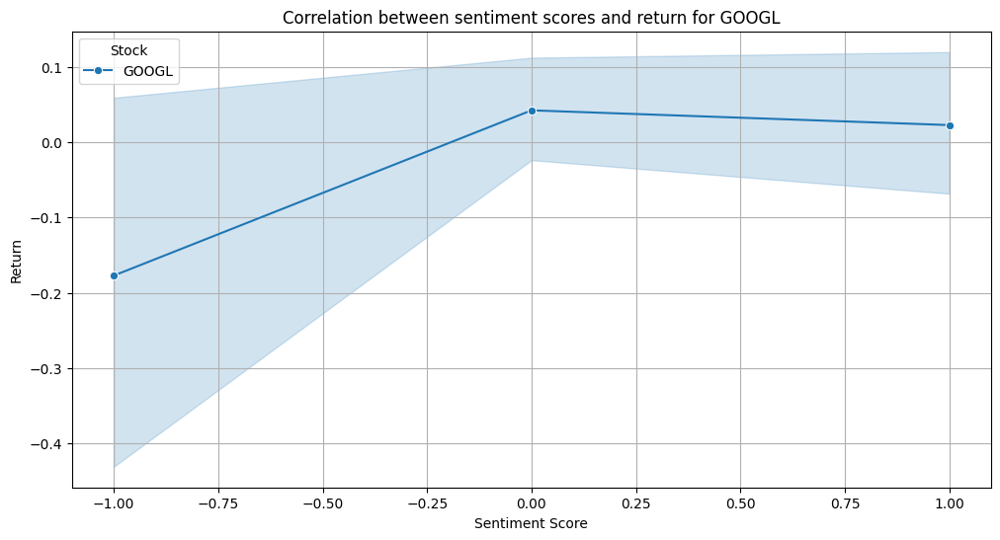
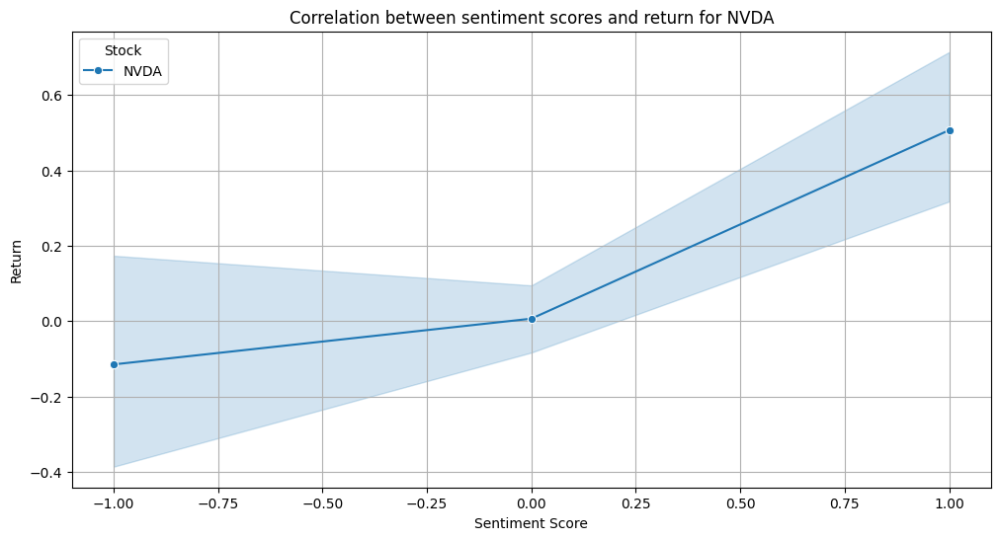
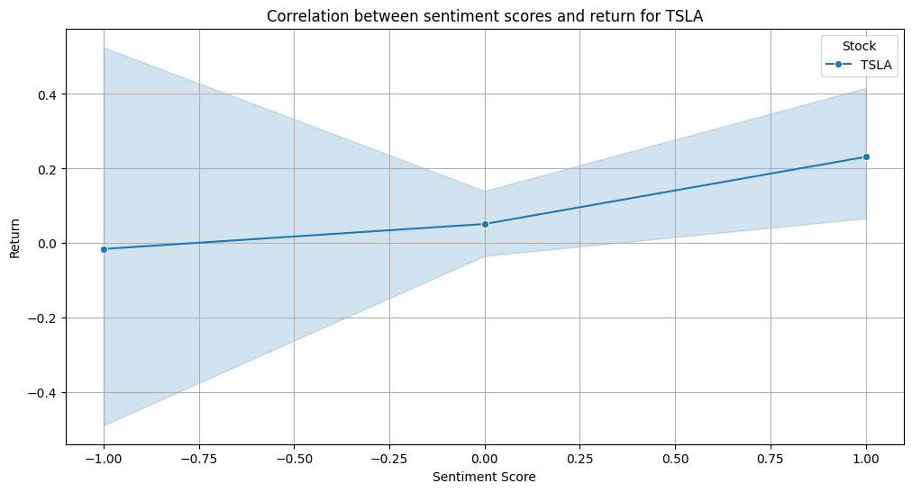
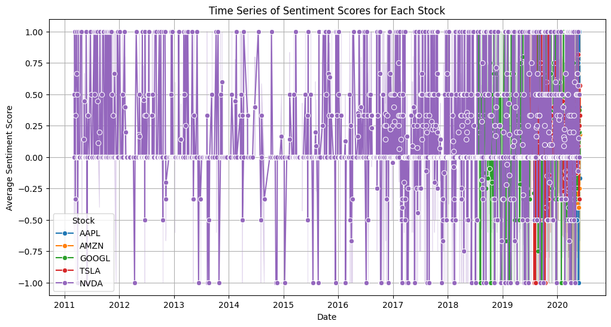

After rigorous time spend preprocessing, cleaning the data, then calculating different technical indicators
and performing sentiment analysis on the news with regards to the stocks and finally calculating the correlation
between the news sentiment and the stock prices. The following report has been prepared.

** Sentiment Trends: **
The time series plots show fluctuations in average sentiment scores over time for AAPL and AMZN.
AAPL displays more variability in sentiment, with notable peaks and troughs, while AMZN shows a more stable pattern.

** Correlation Analysis: **

The correlation plots depict how sentiment scores relate to stock returns for each company.
AAPL: Shows a positive correlation; higher sentiment scores correspond to better returns. This suggests that investor sentiment may significantly influence AAPL's stock performance.
AMZN: Displays a weak negative correlation; as sentiment improves, returns slightly decline. This indicates that other factors may be impacting AMZN's stock more than sentiment.
GOOGL: Similar to AMZN, showing minimal positive correlation.
NVDA and TSLA: Both exhibit positive correlations with sentiment, suggesting a stronger link between sentiment and returns.

** Recommendations based on the output of the data: **

Focus on AAPL: Given the strong positive correlation between sentiment and returns, considering AAPL as a more reliable investment based on sentiment analysis is recommended.
Caution with AMZN: The weak negative correlation suggests that sentiment may not be a reliable indicator for predicting AMZN's stock performance. We should look at broader market and company-specific factors to get better grasp.
Monitor Sentiment for NVDA and TSLA: Both companies show promising correlations, indicating that positive sentiment could lead to better returns.

Incorporate Sentiment Analysis: Financial analysts and Nova Solutions should integrate sentiment analysis into their investment strategies, especially for stocks like AAPL and NVDA, where sentiment appears to correlate well with returns.
Diversify Data Sources: For stocks like AMZN and GOOGL, we should consider using additional data analytics methods beyond sentiment to gauge potential stock performance.
Regular Monitoring: Continuous monitoring of sentiment shifts can provide timely insights for traders and investors, enhancing decision-making processes

The graphs showing the correlations between each stock is provided below to give visual aid.

The behaviour of the sentiments across the different stocks over time can be view as:

